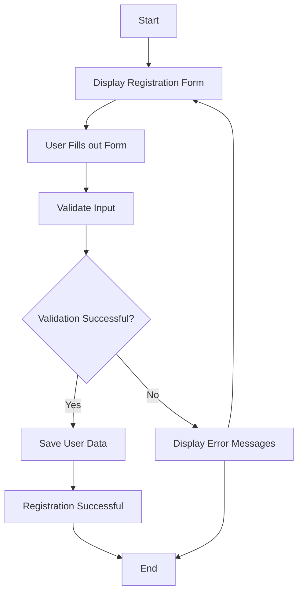

# sec_a_chandru.raj__corejava_project_2
## **Redefine**

****Milestones**[**enter link description here](https://github.com/fssa-batch3/sec_a_chandru.raj__corejava_project_2/milestones)
ER Diagram [enter link description here](https://freeimage.host/i/HDDkYMb)

### Attributes

-   name
-   email
-   password

### Validations

-   validateUser
-   validateEmail
-   validatePassword
-   validateName

### Validation Test

-   testValidateUser
-   testValidateEmail
-   testValidatePassword
-   testValidateName

### DAO

-   createUser

### Service

-   registerUser

### Test

-   testRegisterFeature

**Flow:**

